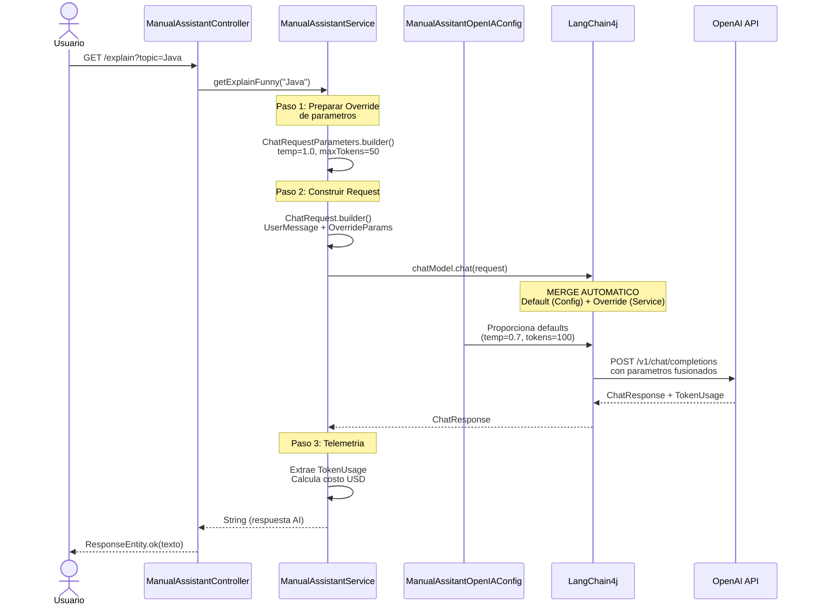

# Manual Assistant - Arquitectura y Flujo

Este paquete implementa un asistente IA usando **LangChain4j con configuracion manual** (no declarativa).

## Diagrama de Secuencia



## Componentes

### 1. ManualAssitantOpenIAConfig
**Responsabilidad**: Configurar el modelo OpenAI con parametros por defecto

**Funciones**:
- Lee API Key desde `application.properties`
- Define parametros base: modelo gpt-4o-mini, temperature 0.7, maxTokens 100
- Expone un bean `ChatModel` inyectable

**Por que existe**: 
Centraliza la configuracion del modelo para que sea facil cambiar parametros globales sin modificar la logica de negocio.

### 2. ManualAssistantService
**Responsabilidad**: Orquestar las llamadas a la IA y anadir telemetria

**Funciones**:
- Recibe el topic del usuario
- Construye parametros especificos (override)
- Llama al modelo con merge automatico
- Calcula costos y loguea metricas

**Patron clave**: 
**Override de parametros** - Sobrescribe los defaults de la config para esta llamada especifica.

### 3. ManualAssistantController
**Responsabilidad**: Exponer endpoint HTTP y manejar entrada/salida

**Funciones**:
- Recibe peticiones GET
- Valida parametros (Spring lo hace automaticamente)
- Delega al servicio
- Retorna ResponseEntity

**Separacion de responsabilidades**:
- Controller: SOLO HTTP
- Service: Logica de negocio + IA

## Flujo Paso a Paso

### Paso 1: Configuracion (Inicio de App)
```
Spring Boot inicia
    ↓
ManualAssitantOpenIAConfig crea ChatModel Bean
    ↓
Parametros por defecto configurados:
    - modelName: "gpt-4o-mini"
    - temperature: 0.7
    - maxOutputTokens: 100
```

### Paso 2: Request HTTP
```
Usuario hace GET /api/v1/manual/explain?topic=Java
    ↓
ManualAssistantController recibe el topic
    ↓
Llama a ManualAssistantService.getExplainFunny("Java")
```

### Paso 3: Construccion del Request (En el Servicio)
```java
// Override de parametros para ESTA llamada
ChatRequestParameters overrideParams = ChatRequestParameters.builder()
    .modelName("gpt-4o-mini")  // Igual
    .temperature(1.0)          // MAS creativo
    .maxOutputTokens(50)       // Mas corto
    .build();

// Construccion del mensaje
ChatRequest request = ChatRequest.builder()
    .messages(UserMessage.from("Tell me a funny explain about Java"))
    .parameters(overrideParams)
    .build();
```

### Paso 4: Merge y Ejecucion (LangChain4j)
```
LangChain4j recibe el request
    ↓
Merge automatico:
    DEFAULT (de Config)    +    OVERRIDE (del Service)
    --------------------         ---------------------
    modelName: gpt-4o-mini       modelName: gpt-4o-mini    ← Usa override
    temperature: 0.7             temperature: 1.0          ← Usa override
    maxOutputTokens: 100         maxOutputTokens: 50       ← Usa override
    
Resultado final:
    modelName: gpt-4o-mini
    temperature: 1.0
    maxOutputTokens: 50
    
    ↓
Envia a OpenAI API
```

### Paso 5: Respuesta y Telemetria
```
OpenAI responde con ChatResponse
    ↓
Extrae TokenUsage:
    - inputTokenCount: 15
    - outputTokenCount: 45
    - totalTokenCount: 60
    
Calcula costo:
    costo = (15 * $0.15/1M) + (45 * $0.60/1M) = $0.00002925
    
Loguea metricas
    ↓
Retorna texto al Controller
    ↓
ResponseEntity.ok(texto) al Usuario
```

## Ejemplo de Uso

### Usando curl
```bash
curl "http://localhost:8080/api/v1/manual/explain?topic=Java"
```

### Usando navegador
```
http://localhost:8080/api/v1/manual/explain?topic=Java
```

### Respuesta esperada
```
Java es como una receta de cocina escrita por un chef muy preciso...
```

## Parametros del Modelo

| Parametro | Default | Override (explicacion humoristica) |
|-----------|---------|-----------------------------------|
| modelName | gpt-4o-mini | gpt-4o-mini |
| temperature | 0.7 | 1.0 (mas creatividad para humor) |
| maxOutputTokens | 100 | 50 (respuestas cortas y graciosas) |

## Costos Estimados (GPT-4o-mini)

- **Input**: $0.15 por 1M tokens
- **Output**: $0.60 por 1M tokens
- **Costo por llamada tipica**: ~$0.00003 USD

## Comparacion: Manual vs @AiService

| Aspecto | Manual (Este) | @AiService (Declarativo) |
|---------|---------------|--------------------------|
| Codigo | Mas verboso | Minimalista |
| Control | Total | Limitado |
| Flexibilidad | Alta (logica custom) | Baja |
| Telemetria | Implementada manualmente | Automatica |
| Uso ideal | Cuando necesitas control total | CRUD simple |

## Ventajas de este Enfoque Manual

1. **Control total**: Puedes modificar cualquier parametro en runtime
2. **Telemetria**: Tienes acceso directo a TokenUsage para calcular costos
3. **Debugging**: Mas facil ver que parametros se estan usando
4. **Flexibilidad**: Puedes anadir logica de negocio compleja antes/desues de la llamada

## Desventajas

1. **Mas codigo**: Requiere mas lineas que @AiService
2. **Complejidad**: Tienes que entender el flujo de LangChain4j
3. **Mantenimiento**: Cambios en la API de LangChain4j requieren actualizar manualmente

## Archivos del Paquete

```
manualAssistant/
├── ManualAssitantOpenIAConfig.java    # Configuracion del modelo
├── ManualAssistantService.java         # Logica de negocio + IA
├── ManualAssistantController.java      # API REST
└── README.md                           # Este archivo
```

## Proximos Pasos Sugeridos

1. **Anadir validacion**: Verificar que el topic no este vacio
2. **Rate limiting**: Limitar llamadas por minuto para controlar costos
3. **Caching**: Cachear respuestas frecuentes para reducir costos
4. **Tests**: Agregar tests unitarios y de integracion
5. **Documentacion API**: Agregar SpringDoc OpenAPI para documentacion automatica

## Notas de Implementacion

- Los parametros se leen de `application.properties` (excluido de git por seguridad)
- Se requiere variable de entorno `OPENAI_TOKEN` para la API Key
- El servicio usa constructor injection (buena practica Spring)
- Se usa Lombok @Slf4j para logging
